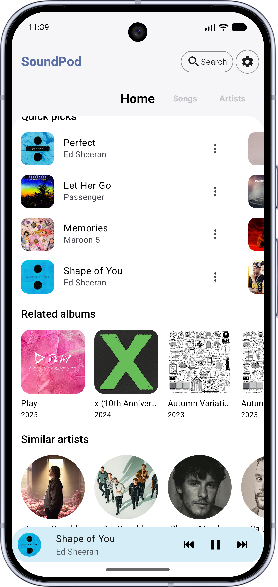
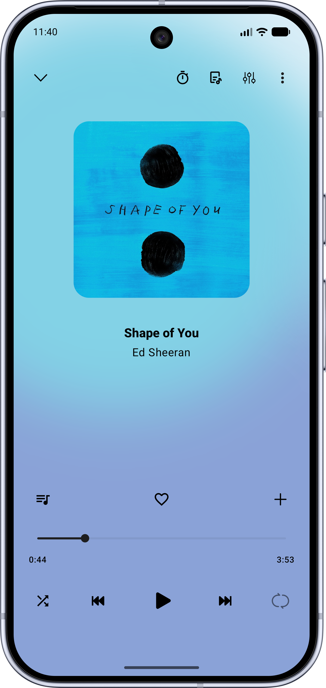
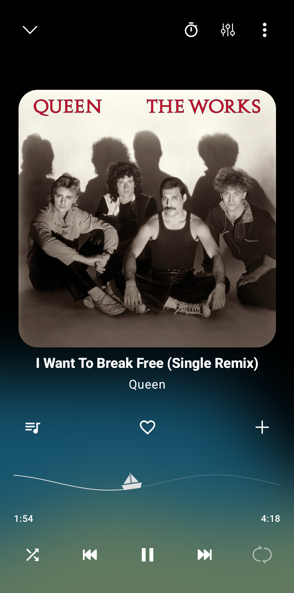

<h1 align="center">
   
  SoundPod
</h1>

  <strong>A minimalist, high-performance YouTube Music client for Android.</strong> 
  Built with Jetpack Compose and Material You for a modern, fluid experience.

  
  
  

---

## 📸 Screenshots

  
  
  

---

## ✨ Features

- 🎧 **Background Playback**: Keep the music going while using other apps or with the screen off.
- ⏬ **Smart Cache**: Automatically cache songs for seamless offline playback.
- 🔍 **Powerful Search**: Find songs, albums, artists, videos, and playlists directly from YouTube Music.
- 📖 **Lyrics Support**: Fetch, display, and edit synchronized lyrics in real-time.
- 🚗 **Android Auto**: Full support for a safe and integrated driving experience.
- 🛠️ **Audio Control**: Features like skip silence, audio normalization, and sleep timer.

---

## 🚀 Roadmap

SoundPod is evolving into a fully resilient, open-source music ecosystem. Upcoming milestones include:

- [ ] **Desktop Expansion**: Porting the SoundPod experience to **Windows** and **Linux** via Compose Multiplatform for a seamless desktop experience.

---

## 📲 Installation

### Stable Releases
You can grab the latest stable APK from the Releases page:

> **Note:** We are currently in the process of joining the **Official F-Droid** repositories. Check back soon for the badges!

---

## 🧩 Credits & Inspiration

Special thanks to:

- [music-you](https://github.com/DanielSevillano/music-you) | [ViMusic](https://github.com/vfsfitvnm/ViMusic) | [RiMusic](https://github.com/fast4x/RiMusic) | [InnerTune](https://github.com/z-huang/InnerTune) | [ViTune](https://github.com/25huizengek1/ViTune) |  [OuterTune](https://github.com/OuterTune/OuterTune) | [Symphony](https://github.com/zyrouge/symphony)
---

## ℹ️ Disclaimer

This project is not affiliated with, authorized, or endorsed by Google LLC or YouTube. It is an independent open-source project designed for streaming media using publicly accessible APIs.
