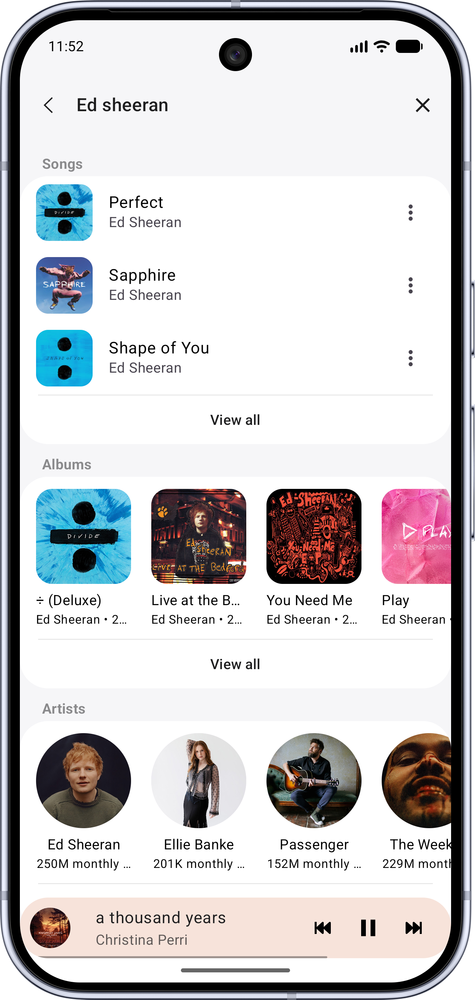
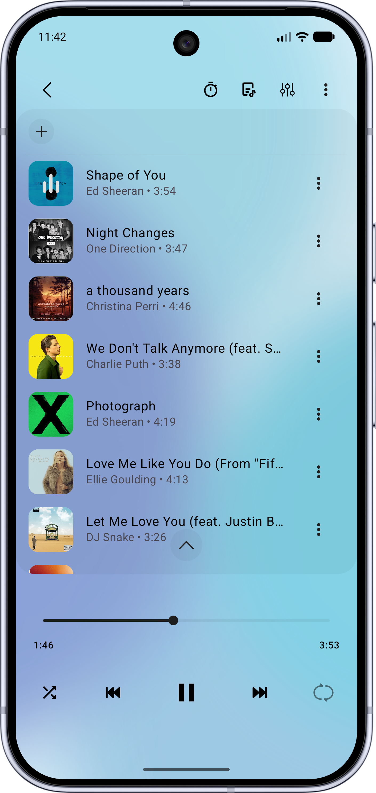
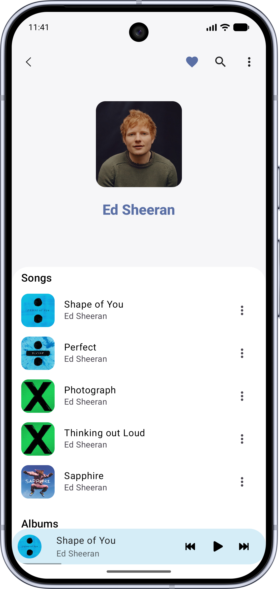
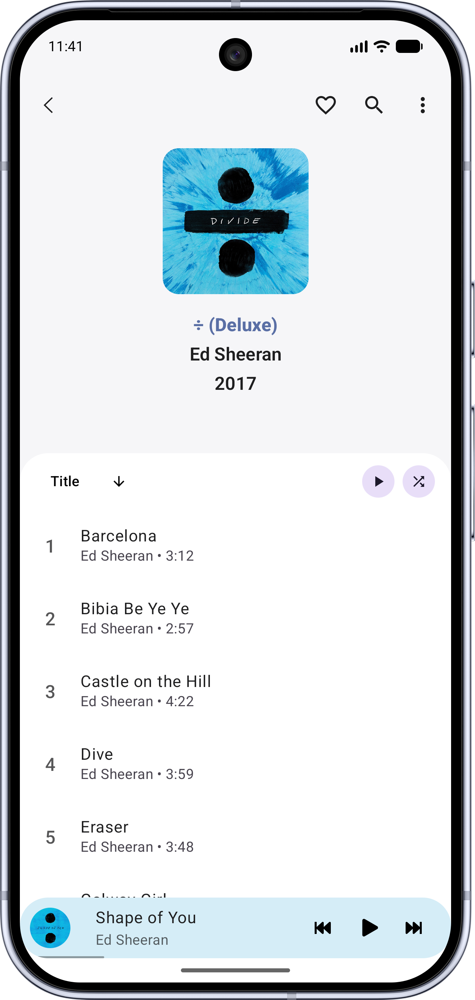

<h1 align="center">
   
  SoundPod
</h1>

  <strong>A minimalist YouTube Music client for Android.</strong> 
  <i>Built with modern Android development using Jetpack Compose.</i>

  
  
  
  
  
  
  

---

## Screenshots

  
  
  
  
  
  

---

## Features

* **Background Playback:** Keep the music going while using other apps or with the screen off.
* **Smart Cache:** Automatically cache songs for seamless offline playback.
* **Powerful Search:** Find songs, albums, artists, videos, and playlists directly from YouTube Music.
* **Lyrics Support:** Fetch, display, and edit synchronized lyrics in real-time.
* **Android Auto:** Support for a safe and integrated driving experience.
* **Audio Control:** Fine-tune your experience with skip silence, audio normalization, and a built-in sleep timer.

---

## Installation

### Stable Releases
Download the latest stable APK directly from GitHub, or get it on F-Droid to receive automatic updates.

  
  

---

## Translation

Localization is managed using [Crowdin](https://crowdin.com/project/soundpod). If you wish to contribute and help translate SoundPod into your language, your help is greatly appreciated!

A special thanks to our translators:
* **French:** [Mickael81](https://github.com/Mickael81)

---

## Credits & Inspiration

SoundPod is built upon the foundation of incredible open-source projects and creative resources. A special thanks to the developers and communities behind:

**Open-Source Projects:**
* [**NewPipe**](https://github.com/TeamNewPipe/NewPipe)
* [**NewPipe Extractor**](https://github.com/TeamNewPipe/NewPipeExtractor)
* [**music-you**](https://github.com/DanielSevillano/music-you)
* [**ViMusic**](https://github.com/vfsfitvnm/ViMusic)
* [**RiMusic**](https://github.com/fast4x/RiMusic)
* [**InnerTune**](https://github.com/z-huang/InnerTune)
* [**ViTune**](https://github.com/25huizengek1/ViTune)
* [**OuterTune**](https://github.com/OuterTune/OuterTune)
* [**Symphony**](https://github.com/zyrouge/symphony)

**UI, Design & Assets:**
* **Samsung Music:** For the core UI inspiration and design language.
* [**SVG Repo**](https://www.svgrepo.com/): For the app icon and various vector graphics used throughout the app.
* **Lottie:** For the background animations (a huge thank you to the original creators of these files).

---

## Disclaimer

> This project is not affiliated with, authorized, or endorsed by Google LLC or YouTube. It is an independent open-source project designed for streaming media using publicly accessible APIs.
